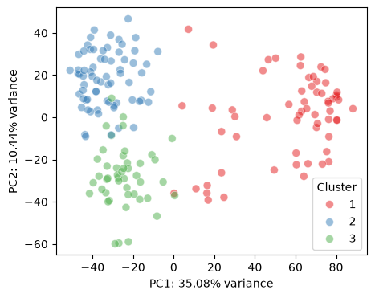
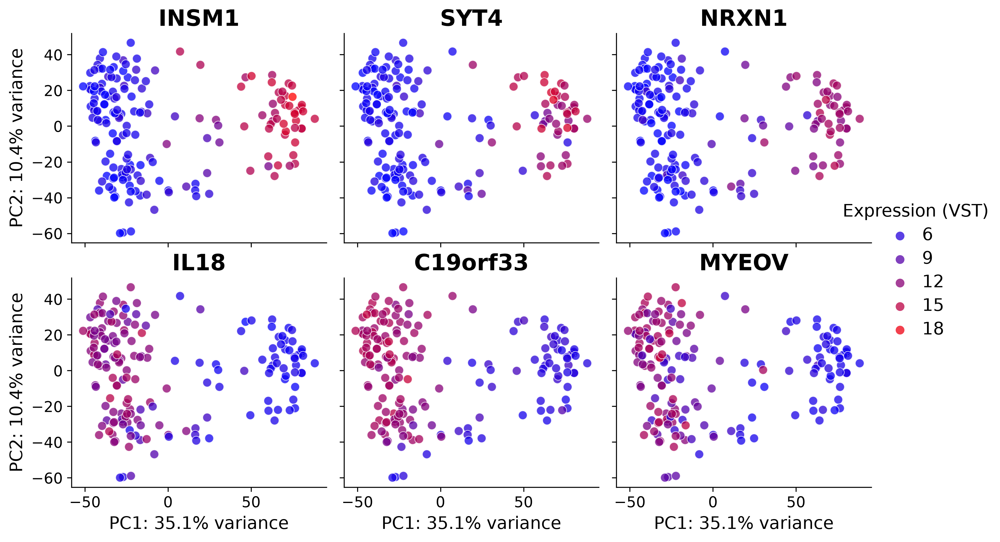
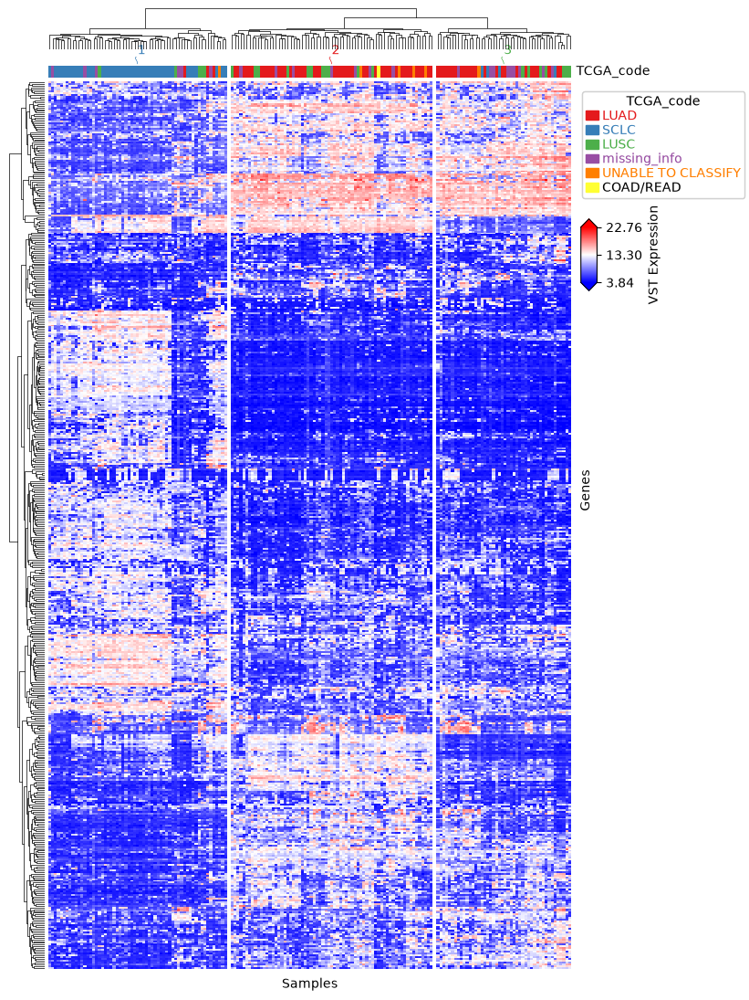
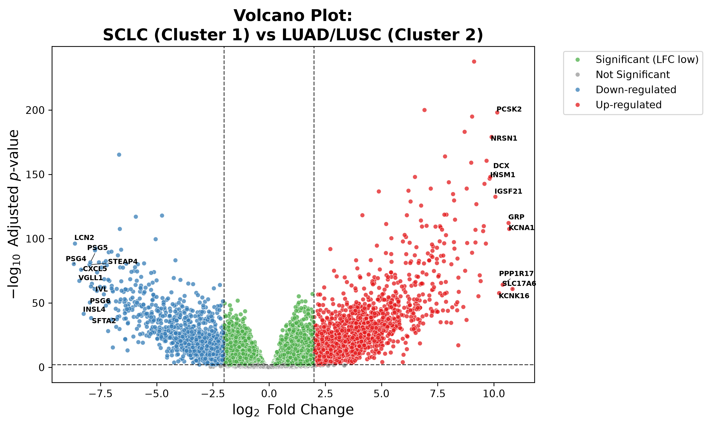

# Lung Cancer Bulk RNA-Seq Analysis Pipeline

An end-to-end computational biology workflow for analyzing bulk RNA-sequencing data from the Cancer Cell Line Encyclopedia (CCLE). This pipeline guides users from raw count matrix processing and unsupervised exploratory analysis (PCA, hierarchical clustering) through differential expression modeling and downstream functional pathway enrichment.

The core pipeline logic is implemented primarily in [Python](./python-wf/), with a supplementary [R workflow](./r-wf/) provided for cross-platform comparison.

## Results & Key Visualizations

Below are representative snapshots illustrating sample partitioning, gene-wise variance, clustering heatmaps, and differential expression profiles across lung cancer lineages:

### Unsupervised Principal Component Analysis (PCA)

  

  <em><b>Figure 1.</b> Principal Component Analysis showing distinct separation between lung cancer cell line based on three main TCGA subtypes.</em>

 

  

  <em><b>Figure 2.</b> PCA loading vector projection highlighting top variance-stabilized genes driving sample separation along major principal components.</em>

### Unsupervised Hierarchical Clustering

  

  <em><b>Figure 3.</b> Clustered expression heatmap displaying standardized VST expression across top variable transcripts, revealing co-regulated gene modules across three main TCGA subtypes.</em>

### Differential Expression: Volcano Plot

  

  <em><b>Figure 4.</b> Volcano plot of differential gene expression comparing SCLC against LUAD/LUSC cohorts. Top upregulated and downregulated hits are highlighted.</em>

### Biological Interpretation

Differential expression analysis reveals a fundamental biological divergence between neuroendocrine and non-neuroendocrine lung cancer lineages:

$$\text{Neuroendocrine Phenotype (SCLC)} \iff \text{Epithelial Phenotype (LUAD/LUSC)}$$

* **Small Cell Lung Cancer (SCLC):** Upregulates neurosecretory processing machinery (`GRP`, `PCSK2`), vesicular synaptic transport (`SLC17A6`), and neuronal structural factors (`DCX`, `NRSN1`).
* **Non-Small Cell Lung Cancer (LUAD/LUSC):** Downregulates neuroendocrine markers and upregulates mucosal/epithelial integrity proteins (`IVL`, `SFTA2`), microenvironmental inflammatory mediators (`LCN2`, `CXCL5`), and oncofetal glycoproteins (`PSG` family).