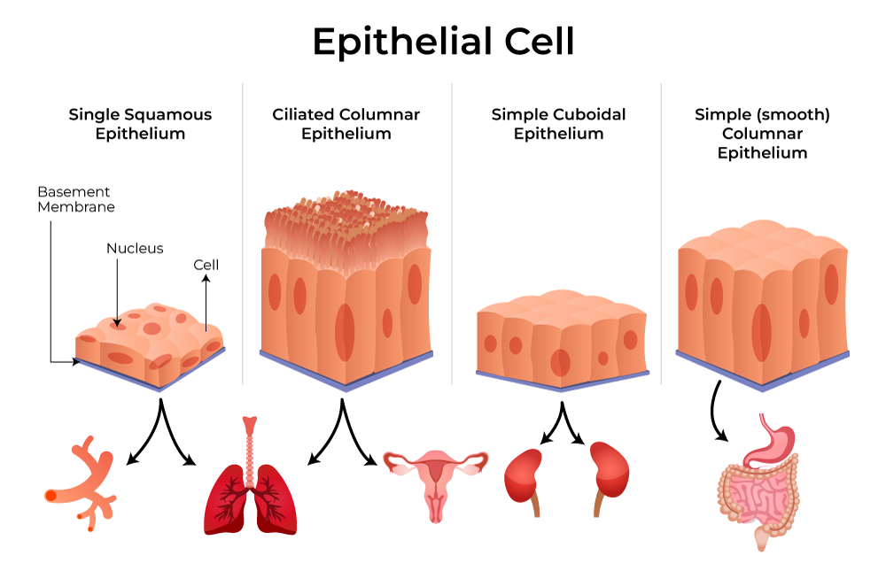

# A Short Primer on Lung Cancer Biology

## 1. Understanding Carcinoma
In clinical oncology, a **carcinoma** is a malignancy that originates in [**epithelial tissue**](#2-epithelial-tissues). This tissue constitutes the skin and the functional linings of internal organs, including the lungs, liver, kidneys, and digestive tract. 

Carcinomas are the most prevalent form of cancer, representing **80% to 90%** of all clinical diagnoses.

> **Etymology:** The term derives from the Greek *karkinoma* ("crab"). Ancient physicians noted that the distended veins surrounding solid tumors resembled the legs of a crab.

### Common Subtypes of Carcinoma
Carcinomas are categorized based on the specific epithelial cell of origin:
* **Adenocarcinoma:** Originates in glandular cells that secrete fluids or mucus (e.g., most breast, prostate, and lung adenocarcinomas).
* **Squamous Cell Carcinoma:** Develops in the flat, scale-like cells lining the organ surfaces and respiratory tract.
* **Basal Cell Carcinoma:** Arises in the deepest layer of the epidermis.

### Classification by Tissue Origin
Cancers are classified by their primary site of origin. While carcinomas begin in the epithelium, other major classifications include:
* **Sarcomas:** Malignancies of connective tissues (bone, muscle, fat, or vascular structures).
* **Leukemias:** Cancers of the blood-forming tissues in the bone marrow.
* **Lymphomas:** Cancers originating in the cells of the immune system.

---

## 2. Epithelial Tissues
Epithelial tissues are densely packed cellular layers that form the body’s protective boundaries. They serve three critical functions:
1.  **Barrier Protection:** Forming the outer integument (skin).
2.  **Lining:** Coating the lumen of hollow organs and tubular structures (lungs, vasculature, gastrointestinal tract).
3.  **Glandular Function:** Forming the secretory structure of glands (sweat, saliva, and hormones).

**The "Opportunity" for Mutation:** Because epithelial cells are constantly exposed to environmental insults, friction, and toxins, they possess a high turnover rate. This rapid rate of cell division provides frequent opportunities for stochastic genetic errors during DNA replication, explaining why carcinomas are the most common cancer type.

### Morphology and Stratification
Epithelial cells are identified by their **shape** and **layering**, which dictate their physiological function.

#### Cell Shapes
* **Squamous (Flat):** Resembling scales, these thin cells facilitate rapid diffusion. They are found in the alveoli (air sacs) of the lungs.
* **Cuboidal (Cube-shaped):** Equal in height and width, these cells provide space for organelles involved in secretion and absorption (e.g., kidney tubules).
* **Columnar (Tall):** Rectangular cells specialized for heavy-duty absorption and mucus secretion, primarily lining the digestive tract.

#### Cellular Layering
* **Simple:** A single layer optimized for filtration and nutrient exchange (e.g., blood vessel linings).
* **Stratified:** Multiple layers built for protection against abrasion. The skin is "stratified squamous" epithelium.
* **Pseudostratified:** A single layer that appears multi-layered due to varying nuclear heights. These often feature **cilia** to move mucus through the respiratory tract.

 

    
    
<em>Source: <a href="https://www.geeksforgeeks.org/biology/epithelial-tissue-introduction-characteristics-types-importance/">GeeksforGeeks</a></em>

---

## 3. Lung Cancer Subtypes
In genomic research, standardized 4-letter **TCGA (The Cancer Genome Atlas)** codes are used to categorize these subtypes. Lung cancer is divided into two primary groups based on histology and clinical behavior.

### Non-Small Cell Lung Cancer (NSCLC)
NSCLC accounts for **80% to 85%** of cases and generally exhibits a slower progression than SCLC.
* **Adenocarcinoma (LUAD):** The most common subtype, typically found in the lung periphery. It originates in mucus-secreting cells and is the most frequent subtype diagnosed in non-smokers.
* **Squamous Cell Carcinoma (LUSC):** Usually arises in the central airways (bronchi) and is strongly associated with smoking history.
* **Large Cell Carcinoma:** An undifferentiated, aggressive cancer that can appear anywhere in the lung and lacks clear glandular or squamous features.

### Small Cell Lung Cancer (SCLC)
Representing **10% to 15%** of cases, SCLC is an exceptionally aggressive neuroendocrine tumor almost exclusively linked to tobacco use. 
* **Small Cell Carcinoma:** Often called "oat cell" cancer due to its microscopic appearance.
* **Combined SCLC:** A rare variant containing both small cell and non-small cell components.

### Rare Thoracic Tumors
* **Lung Carcinoid Tumors:** Slow-growing neuroendocrine tumors (<5% of cases).
* **Mesothelioma:** A rare malignancy of the **pleura** (lung lining), almost exclusively caused by asbestos exposure.
* **LCNEC (Large Cell Neuroendocrine Carcinoma):** A rare, fast-growing NSCLC subtype that shares high-grade neuroendocrine features with SCLC.

---

## 4. The Genomic Landscape
Each subtype is defined by a unique set of "driver mutations"—the genetic alterations that propel oncogenesis.

### Small Cell Lung Cancer (SCLC)
SCLC is defined by extreme genomic instability and high mutational burdens.
* **Hallmark Inactivation:** Near-universal biallelic loss of **TP53** (~100%) and **RB1** (>90%).
* **Amplification:** Frequent amplification of the **MYC** family (*MYC*, *MYCL*, or *MYCN*).

### Lung Adenocarcinoma (LUAD)
LUAD is characterized by a high frequency of "actionable" mutations—errors for which targeted therapies exist.
* **KRAS:** The most frequent driver (~30% of cases).
* **EGFR:** Highly prevalent in non-smokers (up to 50% in Asian populations); the primary target for Tyrosine Kinase Inhibitors (TKIs).
* **Fusions:** Oncogenic fusions involving **ALK**, **ROS1**, and **RET**.

### Lung Squamous Cell Carcinoma (LUSC)
LUSC shares genetic similarities with head and neck squamous cancers.
* **FGFR1 & PIK3CA:** Common amplifications and mutations in signaling pathways.
* **TP53:** Mutated in 80–90% of cases, though typically without the simultaneous loss of *RB1* seen in SCLC.
* **Stress Response:** Frequent mutations in **KEAP1** and **NFE2L2** (oxidative stress pathways).

---

## 5. Comparative Summary

| Feature | SCLC | LUAD (Adenocarcinoma) | LUSC (Squamous) |
| :--- | :--- | :--- | :--- |
| **Origin** | Neuroendocrine | Glandular Epithelium | Squamous Epithelium |
| **Primary Drivers** | *TP53* & *RB1* (Loss) | *KRAS*, *EGFR*, *ALK* | *FGFR1*, *PIK3CA*, *TP53* |
| **Smoking Link** | Extremely High | Moderate/Lower | Very High |
| **Therapy Style** | Chemo/Immunotherapy | Targeted TKIs | Difficult to target |
| **TCGA Code** | N/A | **LUAD** | **LUSC** |
